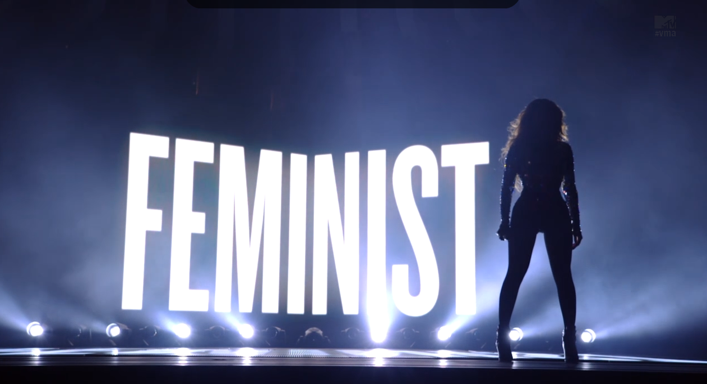
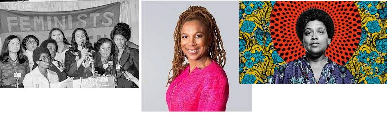
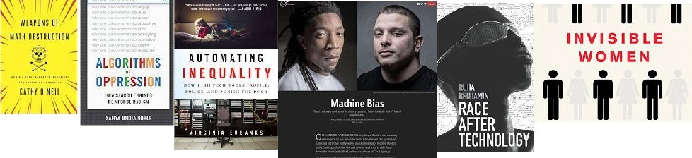
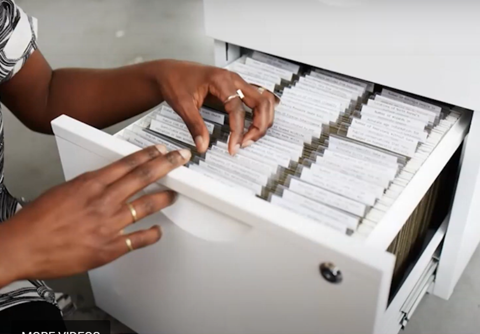
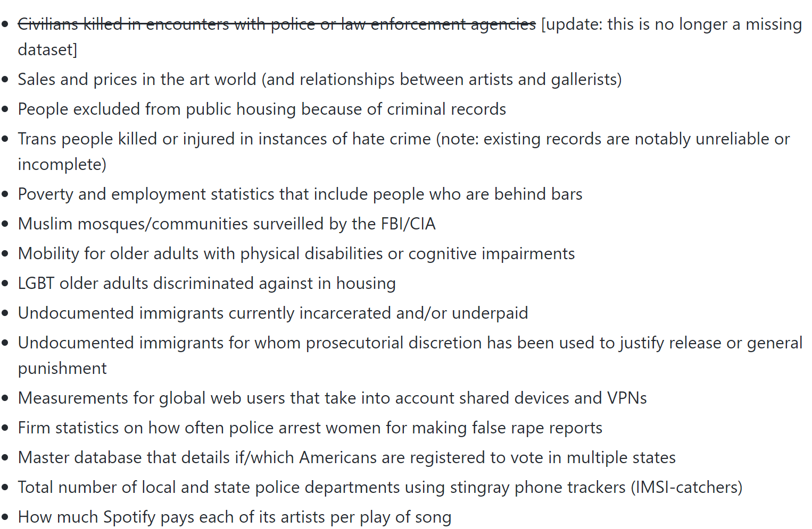
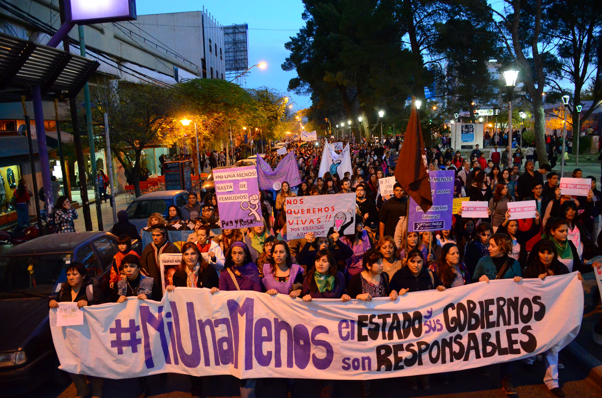
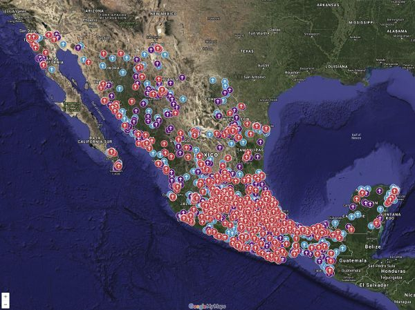
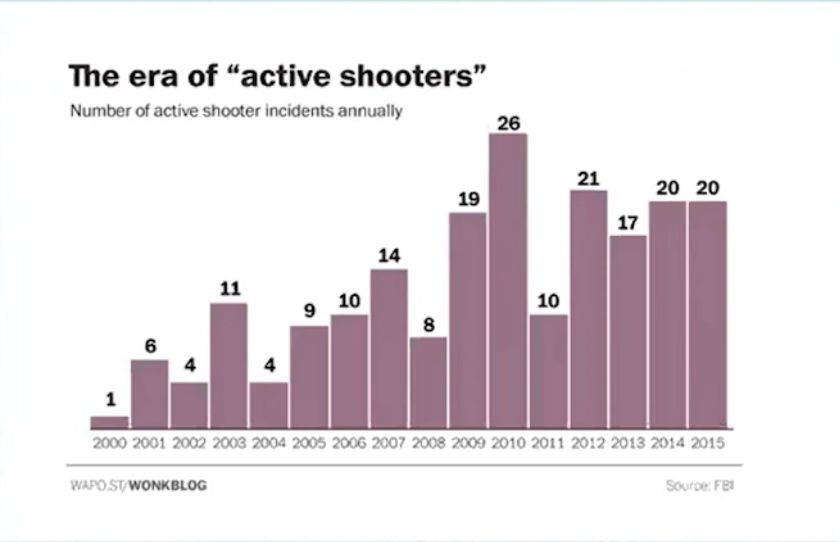

class: center, middle

.larger[.dark-blue[Land Acknowledgement]]

.bayberry[Cal Poly sits on the land of the yak titʸu titʸu yak tiłhini,
Northern Chumash tribe. We acknowledge, respect, and thank the yak titʸu titʸu
yak tiłhini on whose **stolen land** we are guests. 

Indigenous people are not relics of the past. We who work and live here must
bear witness to the ongoing effects of colonization.

<!-- Land acknowledgements do not exist in a past tense, or historical context:  -->
<!-- colonialism is a current ongoing process, and we need to build our mindfulness -->
<!-- of our present participation. -->
]

---

class: center, middle, inverse

.huge[What is "feminism" to you?]

---

class: inverse, center

```{r, echo = FALSE, out.width = "80%"}

```

> Feminist: the person who believes in the social, political, and economic
> equality of the sexes

---

class: center, middle

.larger[Feminism as Action]

> Belief in and advocacy of the political, economic, and social
> equality of the women and men (and non-binary people) through organized
> activity on behalf of women's rights and interests. 
> 
> Merriam Webster

---

class: center, middle, inverse

.larger[Feminism as Theory]

> The theory of the political, economic, and social equality of the sexes.
> 
> Merriam Webster

---

class: center, middle

.larger[.dark-blue[Intersectional Feminism]]

.large[
Focuses beyond women and gender.

Focuses on the distribution of **power** --- Who has it and who doesn't
]

--

.pull-left[

]

.pull-right[
*Intersectionality* is a concept out of Black feminism, conceptually derived by the Combahee River Collective and linguistically created by Kimberlee Crenshaw.
]

---

class: middle, center, inverse

.huge[Data is Power]

---

class: middle, center

.large["**Data is the new oil."**]

> The Economist, Intel CEO, Reliance Industrices CEO, UAE Minister of Artifical Intelligence, Google execs, etc., mainly elite white men

--

.large[**"Data is the same old oppression."**]

> BIWOC, white women, Indigenous people, immigrant communities, LGBTQ+ individuals, + more

</br>


---

class: center

.larger[.dark-blue[7 Principles of Data Feminism]]

.mango[
.midlarge[

Examine Power

Challenge Power

Rethink Binaries and Hierarchies

Elevate Emotion and Embodiment

Embrace Pluralism

Consider Context

Make Labor Visible

]
]

---

class: center, middle, inverse

```{r, echo = FALSE, out.width = c("50%", "50%"), out.height = "125%"}



```

> The Library of Missing Datasets
>
> Mimi Onuoha

---

class: center, middle, inverse

```{r, echo = FALSE, out.width = c("50%", "50%"), out.height = "125%"}



```

> Maria Salguero's map of femicides in Mexico from 2016 - present. 

<!-- Data are crowdsourced from Salguero's reading reports and citizen reports.  -->

---

class: center, middle

.large[
Suppose Cal Poly is interested in summarizing the demographics of their 
undergraduate students. They have designed the following question asking
about student's gender identity:
]

--

.pull-left[
.large[
> **What is your gender identity?**   
> 
> Male, Female, Other

]
]

--

.pull-right[
.honey[.large[Who benefits from these options?]]

.honey[.large[Who suffers from these options?]]
]

---

class: center, middle

.huge[Rethink Binaries]

.rhubarb[.larger[How would you redesign the survey question about student's
gender identity?]]

---

class: center, middle, inverse

.larger[
.honey[What would you say are characteristics of a "good" data visualization?
]
]

---

.larger[An aura objectivity]

.pull-left[

]

.pull-right[
> "We focus on four conventions which imbue visualizations with a sense of objectivity, transparency and facticity. These include: (a) two-dimensional viewpoints, (b) clean layouts, (c) geometric shapes and lines, (d) the inclusion of data sources."  
>
> Kennedy et al. (2016)
]

---

class: center, middle

.huge[Elevate Emotion]

<https://guns.periscopic.com/>

<http://www.antievictionmappingproject.net/narratives.html>

